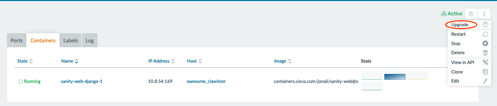
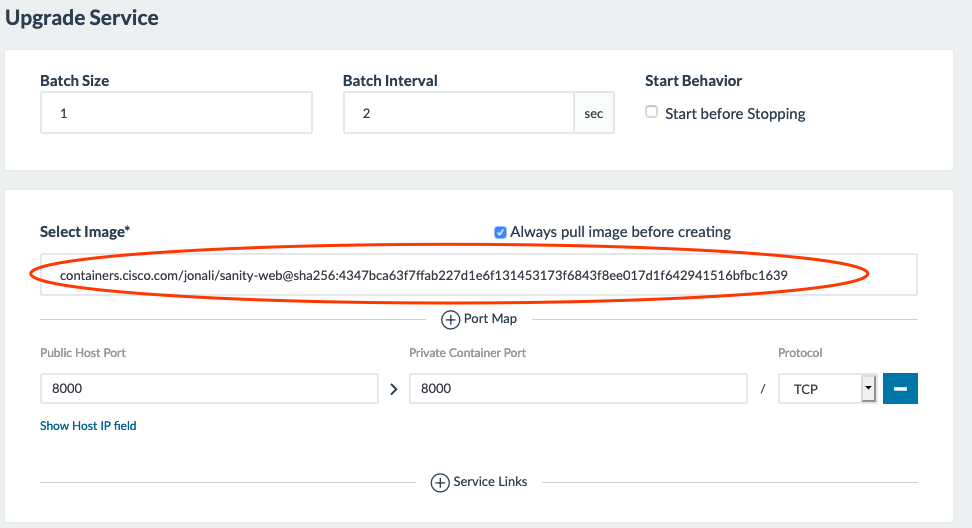

# Sanity-GUI

Django based GUI for the  N9K-Sanity project


## Development

* ### How to deploy dev env on your local setup?

```bash
git clone https://wwwin-github.cisco.com/TaaS/sanity-web.git
cd sanity-web
git checkout containernize
docker-compose up -d
```
and you can visite via http://localhost:8000
If you see errors during docker-compose up, retry it second time.

* ### How to populate local dev db with initial data? (This has already been taken care of in docker-compose)

```bash
mysql -u root -p sanity_gui < n9ksanity_2019-07-16.sql
``` 

for docker:
```bash
docker exec -i  container_name mysql -u root -piloveDC3. sanity_gui < sanity_gui_dev_dump.sql
```

* ### How to pull new changes from master and merge into you branch?
```bash
git fetch -p origin
git merge origin master
git push origin your_branch
```

* ### How to rebuild images (Django + DB) for development use
```bash
docker-compose build
```


* ### Stop and delete current containers and pull in new container
```bash
# list containers
docker ps -a
docker stop container_name
docker rm container_name
# list images
docker images -a
docker rmi image_name

# download latest container images and build
docker-compose up -d
```


## Deployment


* ### How to build Django image for production and push it to container.cisco.com?
```bash
bash build-django-dev.sh
```

* ### How to upgrade service on Crate?

1. Copy image digest serial from uploaded to container.cisco.com as below from last step:

   

2. Go to console.crate.farm and in django service view select "Upgrade":

    

3. Copy image digest to image field in upgrade form:

    